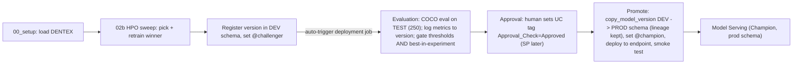

# MLOps best practices: deployment job with cross-schema champion promotion

## Goal
Move detector promotion onto a governed, code-defined MLflow 3 deployment job aligned to the Big Book "deploy code" architecture. The end-to-end intent:

> load data -> HPO sweep -> best model gets the **challenger** alias -> that registration auto-kicks the deployment job -> **evaluation** benchmarks it on the DENTEX **test** split and confirms it is the **best model in the experiment** -> **approval** (current user now, service principal later) -> the winner is **registered as @champion in a separate (prod/broad) schema with full lineage back to its source run/experiment**, and serving is pointed at it.

## Target flow

## Gap analysis (current code vs target MLOps process)
- **Single schema for all stages.** [notebooks/00_config.py](notebooks/00_config.py) uses one `CATALOG=mlops_pj` / `SCHEMA=dais26_vfm`; both `@candidate` and `@champion` live on the *same* registered model. No dev/prod asset separation (Big Book maps env -> catalog/schema). -> add a prod/broad champion schema.
- **Champion is just an alias flip on the dev model.** [src/dais26_dentex/serve/endpoint_manager.py](src/dais26_dentex/serve/endpoint_manager.py) promotes by setting `@champion` on the dev-schema model. -> champion should be a registered version in the prod schema (lineage-preserving copy), not an alias on the dev model.
- **No best-in-experiment gate.** [notebooks/02b_hpo_sweep.py](notebooks/02b_hpo_sweep.py) picks the best *trial* by `val/best_mAP_50` and sets `@candidate`; nothing later verifies the challenger beats the current champion / all prior versions on the **test** benchmark before promotion.
- **Eval is on val, ungated, standalone.** [notebooks/09_eval_comparison.py](notebooks/09_eval_comparison.py) (`EVAL_SPLIT="val"`) is not wired to registration; promotion is decoupled from a benchmark.
- **Per-user experiment.** `EXPERIMENT_NAME = /Users/{user}/dais26-detector` ([notebooks/00_config.py](notebooks/00_config.py)) — not a shared/prod experiment owned by the SP. Breaks the "done by SP eventually" goal and clean lineage.
- **No dataset lineage.** Trainer logs the pyfunc but not `mlflow.log_input` for the DENTEX tables/volume, so the model-version Lineage tab won't show the training data.
- **Terminology drift.** Code says `candidate`; Big Book + your ask say `challenger`. Align.

## Cross-schema promotion mechanism (confirmed)
`MlflowClient.copy_model_version("models:/{dev_model}/{version}", "{prod_model}")` creates a new version in the prod-schema registered model as a **shallow copy** whose version **points back to the source run** -> lineage to the experiment is preserved (MLflow >= 2.8, UC->UC same metastore). The promote task then sets `@champion` on the prod model and deploys that version.

## Prerequisites / risks
- **MLflow 3 upgrade (must-do).** [pyproject.toml](pyproject.toml) pins `mlflow>=2.18.0,<3.0`; deployment-job eval metrics surface on the model-version page only with the MLflow 3 client. Bump to `mlflow>=3.1`, re-verify `DetectorPyfunc` + [src/dais26_dentex/platform/mlflow_io.py](src/dais26_dentex/platform/mlflow_io.py). Biggest lift / main risk.
- Deployment jobs are **Public Preview**; job needs **job-level params `model_name` + `model_version`**, `max_concurrent_runs: 1`, approval task `max_retries: 0`.
- **Permissions:** the promoting principal needs `CREATE MODEL` on the prod schema + `EXECUTE`/read on the dev model. Now = current user; later = `var.sp_app_id` (already the prod `run_as`). The deployment job triggers with the **model owner's** credentials, so the model owner must be able to write the prod schema.

## Changes

### 1. Dependency: MLflow 3
[pyproject.toml](pyproject.toml): bump mlflow; rebuild wheel (`uv build`). Smoke-test unit tests touching mlflow_io / pyfunc.

### 2. Two-schema config + grants
- [notebooks/00_config.py](notebooks/00_config.py): add `CHAMPION_CATALOG` / `CHAMPION_SCHEMA` (default: same catalog `mlops_pj`, new schema e.g. `dais26_vfm_prod` — a "broad"/prod schema; can be a separate catalog later). Derive `CHAMPION_MODEL_NAME = {CHAMPION_CATALOG}.{CHAMPION_SCHEMA}.{DETECTOR_MODEL_SHORT}`.
- [notebooks/00_setup.py](notebooks/00_setup.py): `CREATE SCHEMA IF NOT EXISTS` for the prod schema; grant the SP `USE SCHEMA` + `CREATE MODEL` (and `APPLY TAG`) there.

### 3. Terminology: challenger / champion
- [src/dais26_dentex/config/constants.py](src/dais26_dentex/config/constants.py): rename `ALIAS_CANDIDATE` value `candidate` -> `challenger` (one constant; flows through `mlflow_io.set_candidate_alias`, `02b`, `04`). Champion stays `champion` but now lives on the prod model.

### 4. Shared eval logic (DRY + testable)
Extract from [notebooks/09_eval_comparison.py](notebooks/09_eval_comparison.py) into `src/dais26_dentex/eval/runner.py`: `materialize_gt(volume_path, split)`, `predict_split(...)`, `score_model_on_split(model, volume_path, split)` (-> `mAP_50`, `mAP_50_95`, `per_class_AP50`), name->category_id helper. Update `09` to import these and loop `["val","test"]`.

### 5. Evaluation task `notebooks/10_deploy_eval_task.py`
- Read job params `model_name`, `model_version`; load `models:/{model_name}/{model_version}`.
- `score_model_on_split(..., "test")`; `mlflow.log_metrics(...)` linked to the version (MLflow 3 LoggedModel) so metrics show on the version page.
- **Gate = thresholds AND best-in-experiment:** assert `mAP_50 >= 0.58 AND Caries AP@50 >= 0.30` ([docs/BENCHMARKS.md](docs/BENCHMARKS.md)) AND `test mAP_50 >= ` the current prod `@champion`'s test mAP (and >= other recent challenger versions). Resolve the champion's score from its logged metrics (or re-eval it). Raise to fail otherwise.

### 6. Approval task `notebooks/11_deploy_approval_task.py`
Task name `Approval_Check` (must start with "approval"); pass only when UC tag `Approval_Check == Approved` on the version, else raise (first run fails until a human clicks Approve). Job sets `max_retries: 0`.

### 7. Promote task `notebooks/12_promote_task.py` (cross-schema, lineage-preserving)
- `copy_model_version("models:/{model_name}/{model_version}", CHAMPION_MODEL_NAME)` -> new version in the prod schema, lineage back to the source run preserved.
- `set_registered_model_alias(CHAMPION_MODEL_NAME, "champion", new_version)` (optionally an `APPLY TAG` champion tag too).
- Deploy that prod-schema champion version to the endpoint via an `endpoint_manager` variant that accepts an explicit `{model_name, version}`; smoke test; on failure, do not move `@champion`.

### 8. Deployment job as code `resources/jobs/deploy_job_detector.yml`
Three sequential tasks Evaluation -> Approval -> Promote (`depends_on`). Evaluation on `GPU_1xA10` + `base_environment: databricks_ai_v5` + wheel (mirror [resources/jobs/eval_comparison.yml](resources/jobs/eval_comparison.yml)); Approval/Promote serverless CPU + wheel. Job-level `parameters: model_name, model_version`; `max_concurrent_runs: 1`; Approval `max_retries: 0`. `run_as`: current user on dev, `var.sp_app_id` on prod.

### 9. Connect job to the dev models `scripts/connect_deployment_job.py`
After `databricks bundle deploy`, resolve the deployment job_id and `client.update_registered_model(dev_model_name, deployment_job_id=job_id)` for the **dev-schema** `cradio_detector` + `dinov3_detector` (so a new challenger version auto-triggers it). One parameterized job connected to both.

### 10. Lineage gaps
- Trainer: add `mlflow.log_input(...)` for the DENTEX dataset so the version's Lineage tab shows training data.
- Move `EXPERIMENT_NAME` to a shared workspace experiment path (e.g. under a project folder) so prod/SP runs and the copied champion share one lineage root rather than a per-user experiment.

### 11. Reconcile existing jobs
Keep `eval_comparison` (ad-hoc val+test backbone comparison). Keep `deploy_endpoint` as break-glass manual deploy; the deployment job becomes the primary promotion path. `02b` keeps selecting + retraining the winner and now sets `@challenger` on the dev model -> auto-triggers the job.

### 12. Docs
[docs/BENCHMARKS.md](docs/BENCHMARKS.md): test rows + val=selection/test=published framing + metric caveat. [docs/RUNBOOK.md](docs/RUNBOOK.md) + [docs/ARCHITECTURE.md](docs/ARCHITECTURE.md): deployment-job + cross-schema promotion section, and the gap/alignment notes.

## Out of scope (noted as future)
Full 3-workspace dev/staging/prod split, Lakehouse Monitoring dashboards on inference tables, and automated/triggered retraining — called out in the alignment note, not implemented here.
