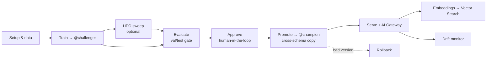

# DAIS26 — MLOps for Deep Learning on AI Runtime

**One frozen vision backbone, three jobs: a detection head, a drift sensor, and an embedding service — driven through the entire MLOps lifecycle on Databricks AI Runtime, from two interchangeable launch lanes.**

This is the documentation for the Data + AI Summit 2026 showcase
[`mshtelma/dais26-mlops-for-dl-on-air`](https://github.com/mshtelma/dais26-mlops-for-dl-on-air):
a Databricks-native reference architecture that fine-tunes a detection head on top of a
**frozen Vision Foundation Model** (NVIDIA C-RADIOv4-SO400M by default; Meta DINOv3 as a
gated comparison) over the **DENTEX** dental X-ray dataset, then takes that model all the way
to a live, governed, monitored production endpoint.

!!! tip "New here? Start with the mental model."
    Read **[Overview & mental model](getting-started/overview.md)** first — it explains the
    five ideas (frozen backbone, two lanes, named config, dev/prod schemas, two-phase deploy)
    that the rest of the docs assume. Then run a **[DAB](getting-started/quickstart-dab.md)**
    or **[air CLI](getting-started/quickstart-air.md)** quickstart.

## One backbone, three jobs

A single frozen backbone artifact in a Unity Catalog Volume feeds three independent downstream
consumers. Nothing downstream retrains or duplicates the backbone, and **no module hardcodes a
feature dimension** — every dimension flows from the `BackboneInfo` contract.

| Job | Backbone output used | Dim (C-RADIOv4 / DINOv3) | Purpose |
|-----|----------------------|--------------------------|---------|
| **Detection** | `spatial_features` | 1152 / 1024 | FPN + RetinaNet head detecting 4 dental pathologies |
| **Embeddings / similarity** | `summary` | 2304 / 1024 | Delta table + Mosaic AI Vector Search index |
| **Drift** | `summary` | 2304 / 1024 | KNN/MMD drift detection on live detector traffic |

See **[Architecture → BackboneInfo contract](ARCHITECTURE.md)** for why `summary` (2304) and
`spatial_features` (1152) are distinct outputs that must never be interchanged.

## Two launch lanes — and they cannot drift

Everything trains on **Databricks AI Runtime / Serverless GPU only** — there are no traditional
ML clusters anywhere in this repo. You launch training (and HPO sweeps) two ways, and both run
the *same* `Trainer` core:

=== "DAB (Asset Bundle)"

    ```bash
    databricks bundle deploy -t dev               # UC + jobs (no endpoints)
    databricks bundle run train_detector -t dev   # train → register @challenger
    ```

    The job runs `notebooks/02_train_detector_air.py` on one `GPU_8xH100` task using the local
    `serverless_gpu.@distributed` helper. **No `torchrun`.**

=== "air CLI"

    ```bash
    air run -f air/workload_train_detector.yaml --watch -p df1
    ```

    The terminal lane snapshots the repo to a Serverless GPU pod and launches the same training
    core under **`torchrun`**.

Both lanes pick hyperparameters from the per-backbone **recipe** (`config/recipes.py`) and UC
locations from the named **environment** (`config/environments.py`) — selected *by name*, so a
target or recipe switch is one token, never a re-statement of values. That is the heart of the
**[lane harmonization](lanes/overview.md)**.

## The full lifecycle



Walk every stage — with **DAB ∥ air shown side-by-side** — in the
**[MLOps Lifecycle](lifecycle/overview.md)** section.

## What you can do here

<div class="grid cards" markdown>

-   :material-rocket-launch: **[Get started](getting-started/overview.md)**

    Prerequisites, install/auth, and a train-to-`@challenger` quickstart on either lane.

-   :material-swap-horizontal: **[Run both lanes](lanes/overview.md)**

    DAB and air CLI references, plus the named-config system that keeps them in lockstep.

-   :material-sync: **[Whole MLOps cycle](lifecycle/overview.md)**

    Setup → train → sweep → eval → approve → promote → serve → embeddings → Vector Search →
    drift → rollback.

-   :material-book-open-variant: **[Scenarios & cookbook](scenarios/switch-backbone.md)**

    Switch backbone, DINOv2 fallback, prod deploy, smoke tests, CI/CD, per-user overrides.

-   :material-sitemap: **[Architecture](ARCHITECTURE.md)**

    System diagrams, the BackboneInfo contract, two-phase deploy, deployment jobs, drift design.

-   :material-file-tree: **[Reference](reference/notebooks.md)**

    Catalogs of every notebook, job, and script; the full config schema; UC map; troubleshooting.

</div>

## Licenses & ethics

| Asset | License | Notes |
|-------|---------|-------|
| Code in this repo | Apache-2.0 | See [`LICENSE`](https://github.com/mshtelma/dais26-mlops-for-dl-on-air/blob/main/LICENSE) |
| DENTEX dataset | CC-BY-NC-SA 4.0 | **Research and demo only. No commercial use.** |
| C-RADIOv4-SO400M weights | NVIDIA Open Model License | Commercial use permitted; ungated on HuggingFace |
| DINOv3 weights | Custom `dinov3-license` (gated) | Comparison backbone only; requires HF token approval |

**No trained model weights are stored in this repository.** Weights are downloaded at runtime and
cached in a UC Volume by
[`scripts/pin_model_cache.py`](https://github.com/mshtelma/dais26-mlops-for-dl-on-air/blob/main/scripts/pin_model_cache.py).
