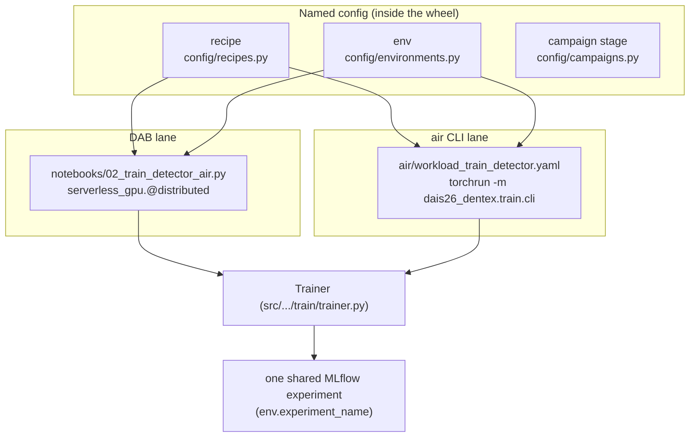

# Lane parity — why DAB and air can't drift

This repo has **two launch lanes** for training and HPO. They differ only in *launch
mechanics*; everything that determines the result — hyperparameters, UC locations, the training
core, the MLflow experiment — is shared. That parity is engineered, not coincidental.

## The two lanes at a glance

| | DAB (Asset Bundle) | air CLI |
|---|---|---|
| Command | `databricks bundle run train_detector -t dev` | `air run -f air/workload_train_detector.yaml -p df1` |
| Surface | notebook job task | terminal → Serverless GPU pod |
| Distribution | `serverless_gpu.@distributed(gpus=8, gpu_type="h100")` | `torchrun --nproc_per_node=… -m dais26_dentex.train.cli` |
| `torchrun`? | **No** | **Yes** |
| Config entry | `00_config.py` (`ENV`) + `build_trainer_config(BACKBONE, …)` | `parameters: { recipe, env }` → `$HYPERPARAMETERS_PATH` |
| HPO driver | `campaign_sweep` job → `02b_hpo_sweep.py` | `workload_sweep.yaml` → `train.sweep_cli` |
| Multi-node | single 8×H100 task | `compute.num_accelerators=16/24/…` spreads across nodes |
| Reference | [DAB lane](dab.md) | [air CLI lane](air.md) |

## What is shared (the anti-drift contract)

Both lanes resolve the **same three named-config sources**, which live *inside the wheel* so an
air pod's `pip install .` and a notebook's `%pip install ..` produce byte-identical dicts:

- **Recipe** — the per-backbone, campaign-final hyperparameters
  ([`config/recipes.py`](https://github.com/mshtelma/dais26-mlops-for-dl-on-air/blob/main/src/dais26_dentex/config/recipes.py)).
- **Environment** — catalog / schema / volume_path / cache_dir / experiment_name
  ([`config/environments.py`](https://github.com/mshtelma/dais26-mlops-for-dl-on-air/blob/main/src/dais26_dentex/config/environments.py)).
- **Campaign stage** — the HPO search space + schedule
  ([`config/campaigns.py`](https://github.com/mshtelma/dais26-mlops-for-dl-on-air/blob/main/src/dais26_dentex/config/campaigns.py)),
  executed by one `SweepRunner`.

And one execution core: [`Trainer`](https://github.com/mshtelma/dais26-mlops-for-dl-on-air/blob/main/src/dais26_dentex/train/trainer.py),
distributed-aware (DDP, rank-0-only MLflow + UC registration) under both `@distributed` and
`torchrun`. Because both lanes log to the **same MLflow experiment** (the env's
`experiment_name`), the promotion gates treat their runs identically.

A target or recipe switch is therefore **one token** — `env: df1` → `env: prod`,
`recipe: cradio_v4_so400m` → `recipe: dinov3_vitl16` — never a re-statement of values. Details:
**[Named configuration](configuration.md)**.

!!! note "Two MLflow surfaces in the air lane — deliberately distinct"
    The air workload's **top-level** `experiment_name` / `mlflow_run_name` track the *air run
    itself*. The named **`env:`**'s `experiment_name` is what aligns the **training** run into the
    shared `dais26_vfm_experiment` that the sweep / deployment-job gates read. The CLI clears the
    ambient `MLFLOW_RUN_ID` (which `air` sets for the workload's own run) so rank 0 logs the
    training run where the gates expect it.

## When to use which

- **DAB** — scheduled jobs, the governed promotion path, anything that should be reproducible
  from a bundle and triggered by Databricks (CI/CD, deployment jobs, cron). It's the lane the
  whole [lifecycle](../lifecycle/overview.md) is wired around.
- **air CLI** — fast terminal iteration, ad-hoc sweeps, multi-node experiments, and "I don't want
  to open a notebook" launches. Snapshots your working tree, so no commit needed to try a change.

Both produce the identical `@challenger` artifact.
