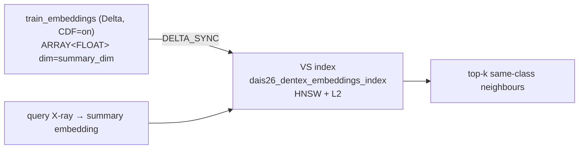
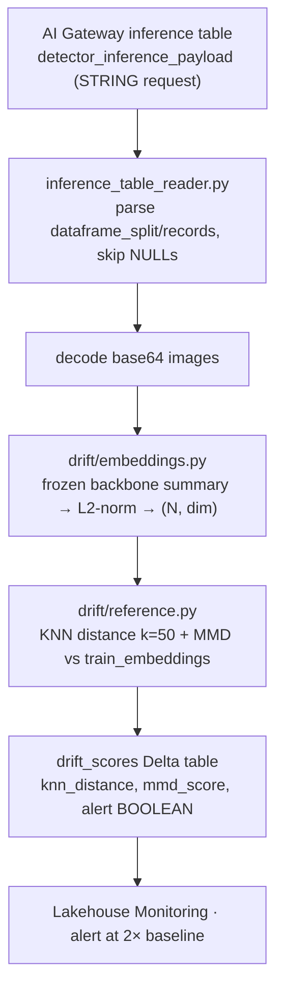

# 6 · Embeddings → Vector Search → drift

The same frozen backbone that detects also powers **similarity search** (via its `summary`
embeddings) and **drift detection** (re-embedding live traffic) — without retraining or a second
model artifact. These three tasks run automatically as the tail of `deploy_champion_job` (so they
always refresh for the model that just became `@champion`), and can be re-run ad hoc.

!!! note "Prod-only subsystem"
    The embeddings table, VS index, and drift scores live in the **champion schema**, so
    `precompute_embeddings`, `create_vector_search`, and `drift_monitor` are **prod-only** jobs —
    run them with `-t prod`.

## 6a · Precompute embeddings (`notebooks/03`)

A frozen-backbone forward pass over all 1005 DENTEX images, extracting `summary` (C-RADIOv4: dim
2304; DINOv3: 1024), L2-normalized, written to `…dais26_dentex_train_embeddings` as
`ARRAY<FLOAT>` with Change Data Feed enabled.

```bash
databricks bundle run deploy_champion_job -t prod --only precompute_embeddings
```

The backbone is **self-selected from the live champion** — it reads the `source_dev_model` tag off
the `@champion` version and reverse-maps to the architecture (falling back to `BACKBONE` only when
there's no champion yet), so the embeddings always match whatever architecture is serving. ~15–20
min on `GPU_1xA10`.

## 6b · Create the Vector Search endpoint + index (`notebooks/04b`)

```bash
databricks bundle run deploy_champion_job -t prod --only create_vector_search
```

Idempotently creates the VS endpoint (`dais26-vfm-vs`) and a `DELTA_SYNC` index over the
embeddings table, triggers a sync, waits for `ONLINE`, and runs a smoke-test similarity query. The
**embedding dimension is derived from the source table** (`size(embedding)`), not hardcoded — so
it stays correct for any backbone (2304 / 1024 / 768). The job fails fast if the embeddings table
is empty.

Query the index: [Vector Search query](../scenarios/vector-search-query.md).



## 6c · Drift baseline + scheduled monitor (`notebooks/05`)

The drift monitor tracks the **detector's** production traffic (it's the decision-maker), with
**zero added latency** — drift runs on a separate job, not the hot path.



`05_drift_demo.py` runs in two modes via `DRIFT_MODE` in `00_config.py`:

=== "demo"

    25 clean val images vs 25 synthetically shifted (contrast=0.5, gamma=2.0), re-embedded via
    `summary`; computes KNN distance (k=50) + bootstrap 95% CI. Acceptance: shifted/clean ratio
    ≥ 2.0 and the CI lower bound > clean baseline. Used in the talk demo.

=== "scheduled"

    `drift.monitor.run_drift_monitor` reads the AI Gateway inference table, re-embeds, and writes
    `knn_distance` / `mmd_score` / `alert` to `…dais26_dentex_drift_scores`. This is what
    `deploy_champion_job`'s `drift_baseline` task and the `drift_monitor` cron run.

The `drift_monitor` job is a **paused** hourly cron (`0 0 * * * ?`, prod). Unpause it after the
demo:

```bash
databricks bundle run drift_monitor -t prod        # one-off run
# or unpause the schedule in the Jobs UI
```

Full walkthrough of both modes: [Drift — demo vs scheduled](../scenarios/drift-monitoring.md).

## Re-run the whole champion refresh

```bash
# deploy → embeddings → VS → drift, all for the current champion:
databricks bundle run deploy_champion_job -t prod
# or just one task:
databricks bundle run deploy_champion_job -t prod --only precompute_embeddings
```

Next: if a champion misbehaves, **[Rollback](rollback.md)**.
