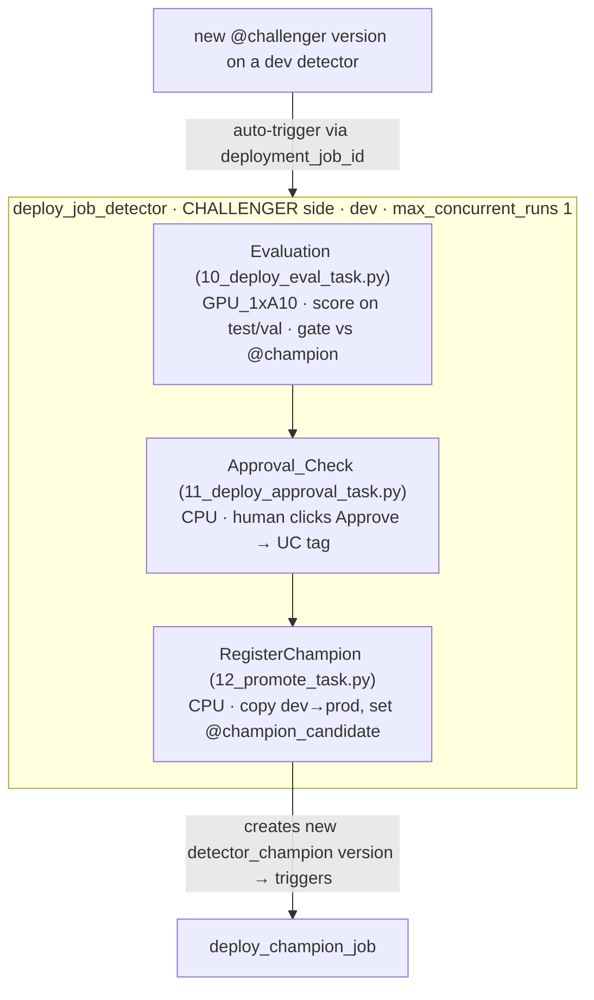

# 4 · Evaluate → approve → promote

This is the governed promotion path: the **challenger-side deployment job**
`deploy_job_detector`. A new `@challenger` version on a dev detector model auto-triggers
**Evaluation → Approval → RegisterChampion**, which copies the approved winner into the prod
champion model and sets `@champion_candidate` — handing off to the
[champion-side job](serve.md).



## Wire the trigger (one-time)

A DAB cannot declare `deployment_job_id` on a registered model, so after every deploy you connect
the jobs to their trigger models:

```bash
databricks bundle deploy -t dev
databricks bundle run connect_deployment_job -t dev    # deploy_job_detector → dev detector models

databricks bundle deploy -t prod
databricks bundle run connect_deployment_job -t prod   # deploy_champion_job → detector_champion
```

`scripts/deploy_bundle.sh -t <target>` runs both steps. Re-run `connect_deployment_job` if a
deployment job is ever recreated (its id changes). See [Production deployment](../scenarios/production-deploy.md).

!!! note "Why a model-VERSION trigger, not `MODEL_ALIAS_SET`"
    Job model/alias triggers are Private Preview and unsupported by the `databricks` Terraform
    provider (`bundle validate` accepts `trigger.model`, but `bundle deploy` fails at apply). The
    model-**version** deployment trigger (`deployment_job_id`) is GA and provider-supported, so the
    champion job fires on the RegisterChampion copy instead. See
    [Architecture → deployment jobs](../ARCHITECTURE.md#deployment-jobs-and-cross-schema-promotion).

## Step 4a — Evaluation (`notebooks/10`)

Runs on `GPU_1xA10` (`databricks_ai_v5`). Re-scores the triggered version on the DENTEX split via
the shared `eval.runner.score_model_on_split`, logs `val/*` (and `test/*` where available) metrics
to the model version's LoggedModel, and **gates**:

- challenger must beat the registered `@champion` (re-scored on the same split) on **≥ 2 of 3**
  metrics (`mAP_50`, `mAP_75`, `mAP_50_95`);
- auto-pass if there is **no** `@champion` yet;
- the campaign gate is `mAP@50 ≥ 0.58 AND Caries AP@50 ≥ 0.30` PLUS best-in-experiment vs prior
  versions (target 0.60).

!!! info "val selects, test publishes"
    The HPO sweep selects + sets `@challenger` from **val** (50 imgs). The deployment-job eval task
    re-scores on **test** (250 imgs) where it can — that's the published number. (DENTEX test ships
    images only, so the challenger registration gate itself runs on the labeled val split.) See
    [Benchmarks](../BENCHMARKS.md).

## Step 4b — Approval (`notebooks/11`)

The task key starts with `approval`, so Databricks treats it as the deployment-job **approval
gate** and shows an **Approve** button on the model-version page. Clicking it auto-repairs the run
and writes a UC tag whose **key == the task name** (`Approval_Check`) with value `Approved`. The
notebook passes only if that tag is set.

To approve, click **Approve** on the model-version page, or set the tag manually and repair-run:

```python
from mlflow.tracking import MlflowClient
c = MlflowClient(registry_uri="databricks-uc")
c.set_model_version_tag(name=MODEL_NAME, version=MODEL_VERSION,
                        key="Approval_Check", value="Approved")
```

The job emails the reviewer when this task starts. No retries — it fails fast and waits for a human.

## Step 4c — RegisterChampion (`notebooks/12`)

`copy_model_version` from dev → `CHAMPION_CATALOG.CHAMPION_SCHEMA` (lineage to the source run
preserved; tags `source_dev_model`), then `set_registered_model_alias(..., "champion_candidate",
<new prod version>)`. It does **not** deploy or touch `@champion`.

The copy creates a **new `detector_champion` version** — which is exactly the event that triggers
the [champion-side job](serve.md). There is no trigger loop: the champion job only sets aliases +
deploys, never creates new champion versions.

## The dev/prod asset split

| | Dev | Prod / champion |
|---|---|---|
| Models | backbone-keyed: `cradio_detector`, `dinov3_detector` | single, backbone-agnostic: `detector_champion` |
| Schema | `CATALOG.SCHEMA` | `CHAMPION_CATALOG.CHAMPION_SCHEMA` |
| Alias | `@challenger` | `@champion_candidate` → `@champion` |
| Bundle-managed? | **No** (runtime-registered by the trainer) | **Yes**, prod-target-only |

Both dev backbones funnel into the **one** prod champion — broad deployment comes from one
schema/model, never two competing architecture-named champions.

## Run a deployment job manually

The deployment jobs are normally version-triggered, but you can run one directly (it reads the
candidate from the alias):

```bash
databricks bundle run deploy_job_detector -t dev
```

Next: the champion side deploys and flips `@champion` → **[Serve & AI Gateway](serve.md)**.
