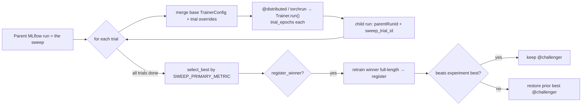

# 3 · HPO sweep (optional)

When a single training run plateaus, run the **HPO campaign** — it tunes the detector head **and**
fine-tunes the backbone, sharing the exact same `Trainer` core as the single-run path. One
`SweepRunner` owns the orchestration (parent run, sequential trials, winner retrains, the
`@challenger` best-in-experiment gate) for **both lanes**.

!!! tip "Audit the architecture first"
    Before sweeping, run `notebooks/diagnostics/02a_arch_probe.py`. It builds a live detector and
    runs `models.arch_probe.probe_detection_model` to report anchor counts, positive-anchor
    fraction per FPN level, delta-clamp overflow, and NMS mode — the diagnostic that surfaced the
    per-level anchor bug that lifted mAP@50 from 0.335 → 0.522. See [HPO campaign log](../HPO.md).

## Launch a stage

Stages live in `config.campaigns.CAMPAIGN_STAGES` (the "push to 0.60" chain — e.g. `dinov3_s1…s4`,
`cradio_s1`, `cradio_long`, `dinov3_fusion`, plus a cheap `smoke` stage).

=== "DAB"

    ```bash
    databricks bundle run campaign_sweep -t dev -- --params sweep_stage=cradio_s2
    ```

    Runs `setup → sweep → confirm_challenger`. The `sweep` task (`02b_hpo_sweep.py`) runs on
    `GPU_8xH100`; `max_concurrent_runs: 5` lets several stages share the GPU pool; the job carries
    a **48-hour** timeout (`timeout_seconds: 172800`).

=== "air CLI"

    ```bash
    air run -f air/workload_sweep.yaml --watch -p df1 --override parameters.stage=cradio_s2
    ```

    One `torchrun` allocation runs the whole stage (sequential trials + winner retrains) on one
    8×H100 node. `timeout_minutes: 2880` (48h). For DINOv3 stages, uncomment the `HF_TOKEN`
    secret block in the workload.

## How a stage runs



- Trial generation/selection (`iter_trials` grid/random + `select_best`) live in
  [`train/sweep.py`](https://github.com/mshtelma/dais26-mlops-for-dl-on-air/blob/main/src/dais26_dentex/train/sweep.py)
  — pure functions, no torch/mlflow, unit-tested in isolation.
- `SWEEP_PRIMARY_METRIC = val/best_mAP_50`.
- **Challenger registration gate**: the retrained winner gets `@challenger` **only if** its
  `val/best_mAP_50` strictly beats the experiment's prior best registered version
  (`sweep.beats_experiment_best`); otherwise `@challenger` is restored to the prior best. This
  prevents a regression from auto-triggering the deployment job.

## What the sweep explores

| Knob | Why it's swept |
|------|----------------|
| `lr`, `backbone_lr` | discriminative LRs — head learns fast, backbone fine-tunes slowly |
| `backbone_mode` | `frozen` / `lora` / `partial` / `full` — how much encoder to fine-tune |
| `backbone_trainable_blocks` | depth of unfreeze for `partial` |
| `anchor_*` (`anchor_layout`, `anchor_base_scale`, octaves, ratios) | the per-level anchor fix |
| `focal_*`, `weight_decay`, `onecycle_pct_start`, augmentation, `img_size`, schedule | head-side regularization / optimization / resolution |
| `fusion_layers` (DINOv3) | multi-layer ViT feature fusion — broke the DINOv3 ~0.535 ceiling |

The search space, strategy, trial budget, per-trial epochs, schedule arm, and `register_winner`
are all config-driven per `CampaignStage`.

## Backbone fine-tuning knobs

| Knob | Values | Effect |
|------|--------|--------|
| `backbone_mode` | `frozen` (default) / `lora` / `partial` / `full` | how much of the encoder receives gradients |
| `backbone_trainable_blocks` | int ≥ 1 | for `partial`: trailing transformer blocks to unfreeze |
| `backbone_lr` | float > 0 | discriminative LR (keep ≈1e-5, 10–100× below the head `lr`) |

!!! warning "Fine-tuning gotchas"
    - `backbone_mode=full` doubles activations vs frozen → drop to `partial`/lower `batch_size` on OOM.
    - `backbone_lr` too high → catastrophic forgetting of the VFM; keep ≈1e-5.
    - DINOv3 is autocast-unstable (fp16 **and** bf16 NaN); `amp_dtype: auto` → fp32 for DINOv3.
    See [Engineering rationale](../RUNBOOK.md#hpo-sweep) and [HPO log](../HPO.md).

## Run the free threshold grid first

`eval_threshold_grid` (notebook `09b`) grids decode/NMS thresholds (`score_threshold`,
`nms_iou_threshold`, `max_detections`) on the **registered** detector with **no retraining** and
banks any free mAP — Stage 0 of the campaign:

```bash
databricks bundle run eval_threshold_grid -t dev
```

After a registering stage (`*_s4`/finalize), the winner is aliased `@challenger`; promotion to
`@champion` then flows through the [deployment jobs](evaluate-approve-promote.md). The full
campaign record (every run, every mAP) is the [HPO campaign log](../HPO.md).

Next: **[Evaluate → approve → promote](evaluate-approve-promote.md)**.
