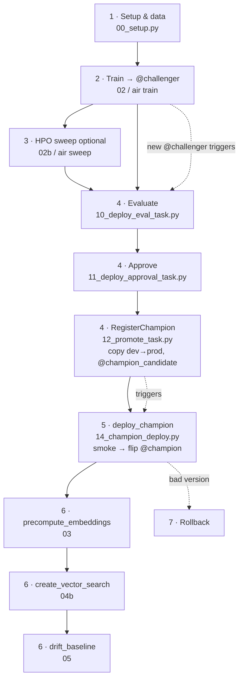

# MLOps lifecycle — overview

This section walks the **entire** lifecycle, from a clean workspace to a live, governed,
monitored champion endpoint — and shows the **DAB and air commands side-by-side** at every stage.

Two MLflow 3 **deployment jobs** orchestrate the governed path, each connected (via
`deployment_job_id`) to the model whose new versions trigger it:

- **`deploy_job_detector`** (challenger side, dev) — a new `@challenger` version triggers
  **Evaluation → Approval → RegisterChampion**.
- **`deploy_champion_job`** (champion side, prod) — the new `detector_champion` version that
  RegisterChampion creates triggers **deploy + smoke + flip `@champion` → embeddings → Vector
  Search → drift**.

The hand-off is the cross-schema copy: RegisterChampion creating a new `detector_champion`
version is exactly the event that triggers the champion job. The champion job only sets aliases +
deploys (never creates new champion versions), so there is no trigger loop.

## The stages

| # | Stage | Notebook(s) | Job / lane | Page |
|---|-------|-------------|-----------|------|
| 1 | Setup & data | `00_setup.py` | `setup` task of every job | [Setup & data](setup-and-data.md) |
| 2 | Train → `@challenger` | `02_train_detector_air.py` | `train_detector` / air `train` | [Train & register](train-and-register.md) |
| 3 | HPO sweep | `02b_hpo_sweep.py` | `campaign_sweep` / air `sweep` | [HPO sweep](hpo-sweep.md) |
| 4 | Evaluate → approve → promote | `10`, `11`, `12` | `deploy_job_detector` (dev) | [Evaluate → approve → promote](evaluate-approve-promote.md) |
| 5 | Serve & AI Gateway | `14`, `04` | `deploy_champion_job` (prod) / `deploy_endpoint` | [Serve & AI Gateway](serve.md) |
| 6 | Embeddings → VS → drift | `03`, `04b`, `05` | `deploy_champion_job` (prod) | [Embeddings → VS → drift](embeddings-vector-search-drift.md) |
| 7 | Rollback | — (SDK / aliases) | manual | [Rollback](rollback.md) |

## Two paths through promotion

- **Governed (primary)** — the two deployment jobs above, triggered automatically by version
  registration. This is the "deploy code" Big-Book pattern the repo is wired around.
- **Break-glass (manual)** — the standalone `deploy_endpoint` job runs `04_deploy_serving.py`
  directly (resolve `@challenger` → numeric version → create/update endpoint → smoke → flip
  `@champion`). Use only for manual redeploys. Covered in [Serve & AI Gateway](serve.md).

## Quickstart vs full lifecycle

The [DAB](../getting-started/quickstart-dab.md) and [air](../getting-started/quickstart-air.md)
quickstarts stop at stage 2 (`@challenger` registered). Everything from stage 4 onward is the
operator lifecycle below. Start at **[Setup & data](setup-and-data.md)**.
