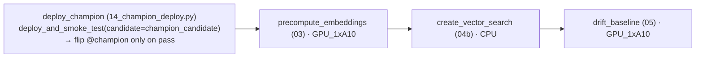

# 5 · Serve & AI Gateway

A model version is served by a **Mosaic AI Model Serving GPU endpoint**, created by SDK (never by
`bundle deploy`). The champion-side deployment job `deploy_champion_job` deploys the
`@champion_candidate`, smoke-tests it, and flips `@champion` **only on success**. The standalone
`deploy_endpoint` job is the break-glass manual path.

## Champion-side deployment job (`deploy_champion_job`, prod)

Triggered automatically when [RegisterChampion](evaluate-approve-promote.md) creates a new
`detector_champion` version:



`deploy_champion` (`notebooks/14`) calls
`endpoint_manager.deploy_and_smoke_test(candidate_alias="champion_candidate",
promote_on_success=True)`:

1. resolve `@champion_candidate` → **numeric** version N (never an alias string in the endpoint);
2. `create_and_wait` (new) or `update_config_and_wait` (existing) on the single prod endpoint
   `dais26-detector-champion`, `GPU_SMALL`, `scale_to_zero=false` (prod);
3. poll `state.ready == "READY"` (a cold multi-GB GPU deploy can take ~1h; the 90-min wait rides
   it out);
4. **smoke test** one real image → expect 200 + detections;
5. on success, flip `@champion = N` (capture the previous champion for rollback); on failure,
   leave `@champion` untouched — the prior champion keeps serving.

`@champion` therefore always means "verified, live-serving". The downstream
[embeddings → VS → drift](embeddings-vector-search-drift.md) tasks then refresh for the new
champion.

## Endpoint configuration (SDK-equivalent)

```python
w.serving_endpoints.create_and_wait(
    name="dais26-detector-champion",
    config=EndpointCoreConfigInput(served_entities=[ServedEntityInput(
        name="detector",
        entity_name="<champion_catalog>.<champion_schema>.detector_champion",
        entity_version="N",            # numeric, resolved from @champion_candidate
        workload_type="GPU_SMALL",     # GPU_MEDIUM if idle util > 85%
        scale_to_zero_enabled=False,   # false for prod; true for dev
    )]),
    ai_gateway=AiGatewayConfig(        # TOP-LEVEL sibling of config (NOT nested)
        inference_table_config=AiGatewayInferenceTableConfig(
            catalog_name=catalog, schema_name=schema,
            table_name_prefix="detector_inference", enabled=True)),
)
```

!!! danger "`ai_gateway` is a top-level argument, not nested under `config`"
    Nesting `ai_gateway` inside `EndpointCoreConfigInput` is a silent no-op (a real bug we hit).
    Also: `serving_endpoints.create_or_update()` does **not** exist — use `create_and_wait`
    (new) / `update_config_and_wait` (existing). See
    [Architecture → ai_gateway placement](../ARCHITECTURE.md#ai_gateway-placement).

## Why SDK-driven, not YAML

`databricks bundle deploy` cannot reference `@champion` before any version exists — a declarative
endpoint resource fails on first deploy. SDK-driven means the endpoint is created **after**
training and **gated on** a passing smoke test, so it never exists in a broken state. See
[Architecture → two-phase deploy](../ARCHITECTURE.md#two-phase-deployment).

## Models-from-code serving load path

The detector is logged via **models-from-code** (`serve/detector_model_script.py`, a script — not
a pickled `DetectorPyfunc()` instance) with the package bundled via `code_paths`. This avoids two
real serving failures: `ModuleNotFoundError: transformers_modules` (the pickled dynamic
`trust_remote_code` backbone class) and `ModuleNotFoundError: dais26_dentex`. The backbone loads
**strictly offline** (`local_files_only`) from the bundled `model_cache`, and `torch.compile` is
disabled at serving. Deep dive: [Models-from-code serving load path](../RUNBOOK.md#models-from-code).

!!! warning "torch/torchvision are cu124-pinned for GPU_SMALL (T4)"
    `[tool.dais26.serving-deps]` pins `torch==2.6.0` / `torchvision==0.21.0` (cu124) and
    `transformers==4.56.2`. An unpinned `torch` resolves to a cu126/cu128 wheel the T4 driver
    (CUDA 12.4) can't init → silent CPU fallback (0% GPU util). See
    [torch/torchvision cu124 pin](../RUNBOOK.md#torch-cu124-pin).

## Break-glass: manual deploy (`deploy_endpoint`)

For a manual (re)deploy without the governed path, run the standalone job — it runs
`04_deploy_serving.py`, switching on `DEPLOY_ACTION` in `00_config.py`:

```bash
databricks bundle run deploy_endpoint -t dev
```

| `DEPLOY_ACTION` | Behavior |
|-----------------|----------|
| `register_and_set_candidate` | verify `@challenger` exists and exit (the quickstart's `confirm` mode) |
| `deploy_and_smoke_test` | resolve → create/update → wait READY → smoke → flip `@champion` on success |
| `create_vector_search` | the VS branch kept in sync with `04b` |

## Smoke test the live endpoint

```bash
export DATABRICKS_HOST=<workspace-url>
export DATABRICKS_TOKEN=<pat>
IMG_B64=$(base64 -i /path/to/xray.png | tr -d '\n')
curl -X POST -H "Authorization: Bearer $DATABRICKS_TOKEN" -H "Content-Type: application/json" \
  -d '{"dataframe_split": {"columns": ["image"], "data": [["'"$IMG_B64"'"]]}}' \
  "https://$DATABRICKS_HOST/serving-endpoints/dais26-detector-champion/invocations"
```

Expected: `{"predictions": [{"boxes": [...], "scores": [...], "labels": ["Caries", ...], "num_detections": N}]}`.
Full walkthrough + the inference table it writes: [Serving smoke test](../scenarios/serving-smoke-test.md).

## AI Gateway inference table

Every request flows through AI Gateway into an auto-created Delta table
(`…dais26_dentex_detector_inference_payload`) — `request`/`response` STRING + `request_time`
TIMESTAMP. No client instrumentation. That table is what the [drift
monitor](embeddings-vector-search-drift.md) reads. Grant the SP `SELECT` on it *after* the first
request via `scripts/grant_inference_table_access.py` (the table doesn't exist until then).

Next: **[Embeddings → Vector Search → drift](embeddings-vector-search-drift.md)** or, if a champion
regresses, **[Rollback](rollback.md)**.
