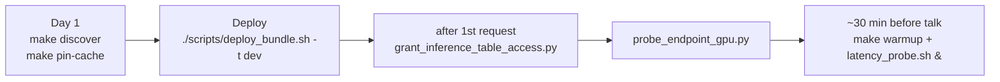

# Scripts catalog

Operator scripts live in `scripts/`. Several have `make` shortcuts (see the
[CLI cheat-sheet](cli.md)).

| Script | `make` | When to run | Purpose |
|--------|--------|-------------|---------|
| [`discover_air_runtime.py`](https://github.com/mshtelma/dais26-mlops-for-dl-on-air/blob/main/scripts/discover_air_runtime.py) | `make discover` | Day 1 / before a demo | AIR runtime discovery gate — confirm the serverless GPU runtime the demo will use (no surprise version drift). |
| [`download_dentex.py`](https://github.com/mshtelma/dais26-mlops-for-dl-on-air/blob/main/scripts/download_dentex.py) | — | (used by `00_setup`) | Download + stage the DENTEX dataset into the `dentex_raw` volume. |
| [`pin_model_cache.py`](https://github.com/mshtelma/dais26-mlops-for-dl-on-air/blob/main/scripts/pin_model_cache.py) | `make pin-cache` | setup / before DINOv2 fallback | Pin C-RADIOv4 weights (by SHA) + bake a DINOv2 fallback head into the `model_cache` volume. |
| [`warmup_endpoints.py`](https://github.com/mshtelma/dais26-mlops-for-dl-on-air/blob/main/scripts/warmup_endpoints.py) | `make warmup` | ~30 min before a demo | Send 5 sample requests to each endpoint to avoid cold-start latency. |
| [`latency_probe.sh`](https://github.com/mshtelma/dais26-mlops-for-dl-on-air/blob/main/scripts/latency_probe.sh) | — | during the talk (background) | Probe the endpoint every 60s; exit 1 after **2 consecutive failures** (the switch-to-video trigger). |
| [`probe_endpoint_gpu.py`](https://github.com/mshtelma/dais26-mlops-for-dl-on-air/blob/main/scripts/probe_endpoint_gpu.py) | — | after an endpoint deploy | Send warm-ups + check the serving GPU-memory dashboard. Acceptance: idle util ≤ 85% on GPU_SMALL. |
| [`grant_inference_table_access.py`](https://github.com/mshtelma/dais26-mlops-for-dl-on-air/blob/main/scripts/grant_inference_table_access.py) | — | **after** the first inference request | Grant the SP `SELECT` on the auto-created `detector_inference_*` table (it doesn't exist until then). |
| [`deploy_bundle.sh`](https://github.com/mshtelma/dais26-mlops-for-dl-on-air/blob/main/scripts/deploy_bundle.sh) | — | local / allowlisted deploy | Idempotently ensure UC schemas exist, then `bundle deploy` + `bundle run connect_deployment_job`. The manual equivalent of `deploy.yml`. Takes `-t dev|prod`. |

## Typical operator timeline

## Notes

- `deploy_bundle.sh` keeps its `SCHEMAS` list and the prod schema resource in sync with
  `notebooks/00_config.py`; it pre-creates the dev schema always and the champion schema only for
  the dev target (prod manages the champion schema via Terraform). See
  [Production deployment](../scenarios/production-deploy.md).
- `latency_probe.sh`'s 2-consecutive-failure threshold matches the
  [switch-to-video procedure](../RUNBOOK.md#switch-to-video-procedure).
- `pin_model_cache.py`'s pre-baked DINOv2 head is what lets the
  [DINOv2 fallback](../scenarios/dinov2-fallback.md) skip retraining.
