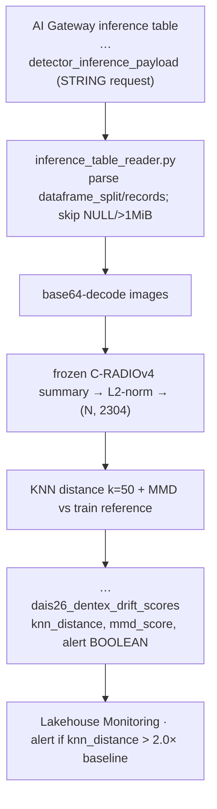

# Drift — demo vs scheduled

The drift monitor detects distribution shift on the **detector's** production traffic by
re-embedding it through the frozen backbone's `summary` head and comparing against the training
reference — with **zero added latency** to detection (it runs on a separate job, not the hot
path). `notebooks/05_drift_demo.py` has two modes, switched by `DRIFT_MODE` in `00_config.py`.

## Demo mode (`DRIFT_MODE = "demo"`)

For the talk and for validating the signal without live traffic:

1. 25 clean val images vs 25 synthetically shifted (contrast=0.5, gamma=2.0).
2. Re-embed all 50 via C-RADIOv4 `summary` (dim 2304), L2-normalized.
3. Reference embeddings come from `…dais26_dentex_train_embeddings`.
4. Compute KNN distance (k=50) + bootstrap 95% CI (1000 iterations).

Acceptance: shifted/clean ratio ≥ 2.0, and the bootstrap CI lower bound > clean baseline.

```python
# 00_config.py
DRIFT_MODE = "demo"
DRIFT_KNN_K = 50
DRIFT_ALERT_THRESHOLD = 2.0
```

## Scheduled mode (`DRIFT_MODE = "scheduled"`)

The production path. `drift.monitor.run_drift_monitor`:



It parses the AI Gateway STRING `request` column (handles `dataframe_split` /
`dataframe_records`, skips NULL rows and >1 MiB payloads), re-embeds via the frozen `summary`
head, and writes `knn_distance` / `mmd_score` / `alert` to the prod `drift_scores` table.

## Run it

The drift baseline refreshes automatically as the tail of `deploy_champion_job`
(`drift_baseline` task). For ongoing monitoring, the `drift_monitor` job is a **paused** hourly
cron (`0 0 * * * ?`, prod):

```bash
# one-off run:
databricks bundle run drift_monitor -t prod
# or run just the baseline task of the champion job:
databricks bundle run deploy_champion_job -t prod --only drift_baseline
# unpause the hourly schedule post-demo in the Jobs UI
```

!!! note "Prod-only, A10 GPU"
    The drift table lives in the champion schema, so `drift_monitor` is prod-only. The
    `drift_baseline` task runs on `GPU_1xA10` (it runs a frozen-backbone forward pass, like
    `precompute_embeddings`) — on a CPU env it fails with "Found no NVIDIA driver".

## Why representation drift (not feature/accuracy drift)

DENTEX has no production labels, so accuracy can't be monitored live. Instead we monitor
**representation drift** (a KNN/MMD shift in the embedding space) as a *leading indicator*.
Retraining stays manual today; the hooks exist (`drift_scores.alert` is a BOOLEAN; Lakehouse
Monitoring can trigger on it). This is the DL-specific substitution for the Big Book's tabular
drift step — see [Deck brief → monitoring](../DECK_BRIEF_DL_MLOPS.md) and
[Architecture → drift monitoring](../ARCHITECTURE.md#drift-monitoring-architecture).

Verify recent rows:

```sql
SELECT * FROM <champion_catalog>.<champion_schema>.dais26_dentex_drift_scores
ORDER BY timestamp DESC LIMIT 10;
```

Acceptance numbers + protocol: [Benchmarks](../BENCHMARKS.md).
