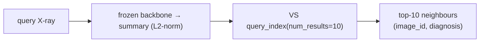

# Vector Search query

Query the DENTEX embeddings index for the nearest neighbours of an image — same-class retrieval
powered by the backbone's `summary` embedding. The index is built by
[Embeddings → Vector Search → drift](../lifecycle/embeddings-vector-search-drift.md).

## Prerequisites

- The embeddings table is populated (`precompute_embeddings`).
- The VS endpoint (`dais26-vfm-vs`) + `DELTA_SYNC` index exist and are `ONLINE`
  (`create_vector_search`).

```bash
databricks vector-search-indexes get <champion_catalog>.<champion_schema>.dais26_dentex_embeddings_index \
  | jq .status
# Expected: {"detailed_state": "ONLINE", "ready": true}
```

## Query by a precomputed vector

```python
from databricks.sdk import WorkspaceClient
w = WorkspaceClient()

results = w.vector_search_indexes.query_index(
    index_name="<champion_catalog>.<champion_schema>.dais26_dentex_embeddings_index",
    columns=["image_id", "diagnosis", "split"],
    query_vector=[0.0] * 2304,   # summary dim: C-RADIOv4=2304, DINOv3=1024, DINOv2=768
    num_results=10,
)
for row in results.result.data_array:
    print(row)
```

The index dimension is **derived from the source table** at creation time, so it matches whatever
backbone is the champion — use the matching `summary` dim for `query_vector` length.

## Query by an image (compute its embedding first)

`notebooks/06_similarity_search_demo.py` does the full loop: take a query X-ray, embed it via the
frozen backbone's `summary` head, query the index, and show the top-10 (most should share the
query's diagnosis). It also reports **same-class recall@10** (target ≥ 0.80 on the 50 val images
against the 705 train images).

```python
# shape (see notebooks/06_similarity_search_demo.py)
from dais26_dentex.drift.embeddings import compute_summary_embedding   # frozen backbone summary
query_vec = compute_summary_embedding(image)            # L2-normalized, dim = summary_dim
res = w.vector_search_indexes.query_index(
    index_name=VS_INDEX_NAME,
    columns=["image_id", "diagnosis", "split"],
    query_vector=query_vec, num_results=10)
```

## What's in the index

- **Source**: `…dais26_dentex_train_embeddings` Delta table (CDF on, `ARRAY<FLOAT>`).
- **Index type**: `DELTA_SYNC` (syncs from the table's Change Data Feed).
- **Metric / structure**: HNSW + L2.
- **Primary key**: `image_id`. Synced columns include `diagnosis`, `split`.
- **Rows**: one embedding per DENTEX image (1005 total).



!!! note "One backbone, two products"
    The embedding here is the **same** frozen backbone output (`summary`) the
    [drift monitor](drift-monitoring.md) uses — and a different output (`spatial_features`) drives
    [detection](../lifecycle/serve.md). One UC artifact, three consumers. See
    [Architecture → BackboneInfo contract](../ARCHITECTURE.md).

Recall numbers and the benchmark protocol: [Benchmarks](../BENCHMARKS.md).
